# Run profile — ht-big

```
Profile: ht-big · 1 invocation · 2026-10-08T05:01Z → 2026-10-08T11:49Z · wall 6h49m (task graph 6h49m) · agents 36 (timed 36) · beads dispatched 13, landed 13, planned 13
Profile: shape — 13 beads · 30 edges · depth 8 · width 1.6 · beads per level 2/2/2/2/2/1/1/1 · widest fan-out ht-big.1 (5 direct, 11 transitive dependents)
Profile: bound — graph lower bound 4h32m along ht-big.1 → ht-big.2.1 → ht-big.2.2 → ht-big.3 → ht-big.5.1 → ht-big.5.2 → ht-big.7 → ht-big.10 (unlimited slots and merge lanes) · model of the run 5h29m (cap 1, one merge lane) vs actual 6h49m (80%) → slot-bound: 54m of the 57m above the graph's bound is the slot cap
Profile: critical path — 6h49m = implement 2h59m · review 18m · fix 11m · merge 19m · planning 5m · other 26m · dispatch 5m · slot 53s · wait 2h24m
Profile: critical chain — lazy other 26m → plan planning 5m → ht-big.9 implement+review+fix+merge 14m → ht-big.2.1 implement+review+merge 21m → ht-big.2.2 implement+review+merge 17m → ht-big.3 implement+review+fix+merge 43m → ht-big.5.1 implement+review+merge 25m → ht-big.5.2 implement+review+merge 31m → ht-big.6 implement+review+merge 16m → ht-big.7 implement+merge+review 34m → ht-big.10 implement+merge+review 26m
Profile: bottleneck — ht-big.3 — 59m on the critical path (15%) · implement 31m · review 2m · fix 8m · merge 2m · wait 16m · implement on the path 31m: test 34s · poll 36s · git 13s · read 3s · shell 5s · other 2s · model 30m (longest: "scripts/check-default-features > .tmp/ht-big.3/default-feat…" 12s, "git add src/protocol/capabilities.rs src/protocol/commands.…" 6s) · dependents 5 direct, 5 transitive
Profile: waits — ready→start, summed per bead (beads wait at the same time, so not wall time): 5h52m over 12 of 13 landed beads — slot 2h23m (3) · retry 1h14m (3) · unexplained 2h15m (6)
Profile: rework — 27m of dispatch time in attempts that did not land — ht-big.2.1 17m (?; landed later) · ht-big.9 6m (?; landed later) · ht-big.2.2 4m (?; landed later)
Profile: tests — implementers and fixers, summed: 6m running tests and 8m polling background runs, 6% of their 4h04m · 0 Bash call(s) ran into the 10-minute tool limit
Profile: redo — on the critical path, up to retries 34m (ht-big.9, ht-big.2.1, ht-big.2.2) — from a bead's first attempt to its final one; the what-ifs model the real saving
Profile: merge lane — busy 27m of 5h18m (9%) · seam reviews and fixes 0s (0% of busy) · 15 merge dispatches, first try not merged for 2 of 13 · queue wait 10m total, peak 1 waiting · stack-parent wait 0s
Profile: concurrency — 36 dispatches over 6h47m · a dispatch running 4h59m (73%) · dispatches at once: 0 for 27% · 1 for 72% · 2 for 2% of the time · peak 2
Profile: dispatch time by kind, summed — impl 3h53m (16) · review 25m (13) · fix 11m (2) · plan 10m (2) · not named for a bead: lazy 26m (2) · dev 2m (1) · merges run by the coordinator 27m (15)
Profile: runtime — peak 2 agents at once · slot cap 1
Profile: what-if — unlimited slots → 4h35m (−54m, 16%) — no slot cap
Profile: what-if — faster ht-big.3 → 5h13m (−16m, 5%) — its implement time halved
Profile: what-if — faster ht-big.7 → 5h13m (−16m, 5%) — its implement time halved
Profile: unmeasured — 3 dispatch(es) not named for a bead of ht-big, in the run-level lines only (coordinator-subagents.md names dispatches <kind>_<bead id> on Codex, <kind>:<bead id> on Claude Code)
```

## Per bead

Offsets are from the run's first dispatch. `wait` is from the moment every blocker was usable (its implementation under early unblock, else its merge) to the implementer starting, with its cause; `stack` is a stacked task waiting for its parents to merge; `queue` is the wait for the single merge lane; `lane` is its lane turn (merge plus seam work).

| bead | deps | dependents | attempts | wait (cause) | implement | of it: tools | review | fix | stack | queue | lane (seam) | landed | critical |
|---|---|---|---|---|---|---|---|---|---|---|---|---|---|
| ht-big.1 | 0 | 5 | IMPLEMENTED | 1m (unexplained) | 12m | test 16s · poll 40s · build 8s · git 8s · shell 2s | 1m | - | - | 18s | 2m | +1h33m |  |
| ht-big.9 | 0 | 2 | ?, IMPLEMENTED | 24m (retry) | 10s | - | 3m | 2m | - | 22s | 3m | +1h50m | 34m |
| ht-big.2.1 | 2 | 3 | ?, IMPLEMENTED | 19m (retry) | 11s | - | 2m | - | - | 21s | 2m | +2h13m | 23m |
| ht-big.4.1 | 1 | 2 | IMPLEMENTED | 40m (slot) | 14m | test 33s · poll 49s · git 7s · shell 8s · other 1s | 2m | - | - | 16s | 3m | +2h33m |  |
| ht-big.2.2 | 1 | 3 | ?, IMPLEMENTED | 31m (retry) | 10m | test 10s · poll 30s · build 3s · git 6s · shell 10s | 2m | - | - | 21s | 2m | +2h59m | 46m |
| ht-big.8 | 2 | 2 | IMPLEMENTED | 46m (unexplained) | 8m | poll 37s · build 3s · git 6s · shell 24s | 2m | - | - | 19s | 1m | +3h11m |  |
| ht-big.3 | 2 | 5 | IMPLEMENTED | 14m (unexplained) | 31m | test 34s · poll 36s · git 13s · read 3s · shell 5s · other 2s | 2m | 8m | - | 33s | 2m | +3h58m | 59m |
| ht-big.4.2 | 1 | 2 | IMPLEMENTED | 47m (unexplained) | 20m | poll 2s · build 25s · git 14s · read 3s · shell 1m | 2m | - | - | 16s | 1m | +4h23m |  |
| ht-big.5.1 | 1 | 2 | IMPLEMENTED | 26m (unexplained) | 17m | test 35s · poll 20s · build 8s · git 10s · read 2s · shell 11s · other 2s | 1m | - | - | 20s | 6m | +4h49m | 51m |
| ht-big.5.2 | 2 | 2 | IMPLEMENTED | - | 26m | test 53s · poll 1m · git 12s · read 5s · shell 14s · other 2s | 3m | - | - | 30s | 2m | +5h22m | 32m |
| ht-big.6 | 2 | 1 | IMPLEMENTED | 1h24m (slot) | 13m | test 40s · poll 16s · build 10s · git 8s · read 3s · shell 10s | 2m | - | - | 15s | 2m | +5h40m | 18m |
| ht-big.7 | 4 | 1 | IMPLEMENTED | 18m (slot) | 31m | test 1m · poll 1m · build 2s · git 11s · read 3s · shell 31s · other 2s | 2m | - | - | 6m | 4m | +6h21m | 41m |
| ht-big.10 | 12 | 0 | IMPLEMENTED | 32s (unexplained) | 24m | test 6s · poll 21s · build 7s · git 3s · read 2s · shell 1m · other 2s | 2m | - | - | 16s | 3m | +6h49m | 28m |

## Critical path, step by step

| at | step | kind | via | duration |
|---|---|---|---|---|
| +0s | lazy_design_review | other |  | 2m |
| +2m | previous → lazy_super_design | wait |  | 44m |
| +46m | lazy_super_design | other | previous | 24m |
| +1h10m | previous → plan | wait |  | 45s |
| +1h11m | plan | planning | previous | 5m |
| +1h15m | planned → impl:ht-big.9 | wait |  | 18m |
| +1h34m | impl:ht-big.9 | implement | planned | 6m |
| +1h39m | retry → impl:ht-big.9 | dispatch |  | 20s |
| +1h40m | impl:ht-big.9 | implement | retry | 10s |
| +1h40m | chain → review:ht-big.9 | wait |  | 49s |
| +1h41m | review:ht-big.9 | review | chain | 3m |
| +1h43m | chain → fix:ht-big.9 | wait |  | 56s |
| +1h44m | fix:ht-big.9 | fix | chain | 2m |
| +1h47m | chain → merge:ht-big.9 | dispatch |  | 22s |
| +1h47m | merge:ht-big.9 | merge | chain | 3m |
| +1h50m | dep → impl:ht-big.2.1 | wait |  | 2m |
| +1h51m | impl:ht-big.2.1 | implement | dep | 17m |
| +2h08m | retry → impl:ht-big.2.1 | dispatch |  | 6s |
| +2h09m | impl:ht-big.2.1 | implement | retry | 11s |
| +2h09m | chain → review:ht-big.2.1 | dispatch |  | 23s |
| +2h09m | review:ht-big.2.1 | review | chain | 2m |
| +2h11m | chain → merge:ht-big.2.1 | dispatch |  | 21s |
| +2h11m | merge:ht-big.2.1 | merge | chain | 2m |
| +2h13m | dep → impl:ht-big.2.2 | wait |  | 21m |
| +2h34m | impl:ht-big.2.2 | implement | dep | 4m |
| +2h38m | retry → impl:ht-big.2.2:resume | wait |  | 7m |
| +2h44m | impl:ht-big.2.2:resume | implement | retry | 10m |
| +2h54m | chain → review:ht-big.2.2 | dispatch |  | 28s |
| +2h55m | review:ht-big.2.2 | review | chain | 2m |
| +2h57m | chain → merge:ht-big.2.2 | dispatch |  | 21s |
| +2h57m | merge:ht-big.2.2 | merge | chain | 2m |
| +2h59m | dep → impl:ht-big.3 | wait |  | 14m |
| +3h12m | impl:ht-big.3 | implement | dep | 31m |
| +3h44m | chain → review:ht-big.3 | wait |  | 47s |
| +3h44m | review:ht-big.3 | review | chain | 2m |
| +3h47m | chain → fix:ht-big.3 | wait |  | 59s |
| +3h48m | fix:ht-big.3 | fix | chain | 8m |
| +3h56m | chain → merge:ht-big.3 | wait |  | 33s |
| +3h56m | merge:ht-big.3 | merge | chain | 2m |
| +3h58m | dep → impl:ht-big.5.1 | wait |  | 26m |
| +4h24m | impl:ht-big.5.1 | implement | dep | 17m |
| +4h41m | chain → review:ht-big.5.1 | wait |  | 35s |
| +4h42m | review:ht-big.5.1 | review | chain | 1m |
| +4h43m | chain → merge:ht-big.5.1 | dispatch |  | 20s |
| +4h44m | merge:ht-big.5.1 | merge | chain | 6m |
| +4h49m | dep → impl:ht-big.5.2 | dispatch |  | 27s |
| +4h50m | impl:ht-big.5.2 | implement | dep | 26m |
| +5h16m | chain → review:ht-big.5.2 | wait |  | 56s |
| +5h17m | review:ht-big.5.2 | review | chain | 3m |
| +5h20m | chain → merge:ht-big.5.2 | dispatch |  | 30s |
| +5h20m | merge:ht-big.5.2 | merge | chain | 2m |
| +5h22m | slot → impl:ht-big.6 | slot |  | 27s |
| +5h22m | impl:ht-big.6 | implement | slot | 13m |
| +5h36m | chain → review:ht-big.6 | wait |  | 39s |
| +5h36m | review:ht-big.6 | review | chain | 2m |
| +5h38m | chain → merge:ht-big.6 | dispatch |  | 15s |
| +5h38m | merge:ht-big.6 | merge | chain | 2m |
| +5h40m | slot → impl:ht-big.7 | slot |  | 26s |
| +5h40m | impl:ht-big.7 | implement | slot | 31m |
| +6h11m | chain → merge:ht-big.7 | wait |  | 6m |
| +6h17m | merge:ht-big.7 | merge | chain | 0s |
| +6h17m | chain → review:ht-big.7 | dispatch |  | 19s |
| +6h17m | review:ht-big.7 | review | chain | 2m |
| +6h19m | chain → merge:ht-big.7 | dispatch |  | 16s |
| +6h19m | merge:ht-big.7 | merge | chain | 1m |
| +6h21m | dep → impl:ht-big.10 | wait |  | 32s |
| +6h21m | impl:ht-big.10 | implement | dep | 24m |
| +6h45m | chain → merge:ht-big.10 | dispatch |  | 16s |
| +6h45m | merge:ht-big.10 | merge | chain | 1s |
| +6h45m | chain → review:ht-big.10 | dispatch |  | 23s |
| +6h46m | review:ht-big.10 | review | chain | 2m |
| +6h47m | chain → merge:ht-big.10 | dispatch |  | 21s |
| +6h48m | merge:ht-big.10 | merge | chain | 55s |

## Longest tool calls in the bottleneck's implement (ht-big.3)

| tool | category | what | duration |
|---|---|---|---|
| exec | poll | scripts/check-default-features > .tmp/ht-big.3/default-feat… | 12s |
| exec | git | git add src/protocol/capabilities.rs src/protocol/commands.… | 6s |
| exec | test | head -30 tests/combined.rs | 6s |
| exec | test | cat > tests/protocol/lazy_inbox_v2.rs <<'EOF' | 5s |
| exec | poll | cat docs/superpowers/runs/2026-10-07-lazy-messages/2026-10-… | 5s |
| exec | poll | cargo test --locked --all-features --lib store::queries > .… | 4s |
| exec | test | python3 - <<'PY' | 4s |
| exec | test | python3 - <<'PY' | 3s |
| exec | test | python3 - <<'PY' | 3s |
| exec | test | python3 - <<'PY' | 3s |

## Schedule model

Landed beads replayed with their measured implement, review+fix and lane times; planner timing kept as it ran; dependents start at a blocker's implementation except over edges where this run's dependent waited for the merge. Model of the run: 5h29m against 6h49m measured. Estimates, not measurements.

| scenario | makespan | saving |
|---|---|---|
| as run (cap 1, one merge lane) | 5h29m | - |
| unlimited slots | 4h35m | 54m |
| unlimited merge lanes | 5h28m | 55s |
| graph lower bound (both) | 4h32m | 57m |
| faster ht-big.3 | 5h13m | 16m |
| faster ht-big.7 | 5h13m | 16m |

## Timeline

each bead's final attempt; critical-path steps are marked crit.

```mermaid
gantt
  dateFormat x
  axisFormat %H:%M
  section ht-big.1
  impl :1791440298783, 1791440997817
  review :1791441035830, 1791441123364
  merge :1791441141361, 1791441275405
  section ht-big.9
  impl :crit, 1791441669601, 1791441679503
  review :crit, 1791441728099, 1791441887326
  fix :crit, 1791441943748, 1791442088218
  merge :crit, 1791442109759, 1791442269303
  section ht-big.2.1
  impl :crit, 1791443399291, 1791443410712
  review :crit, 1791443434114, 1791443532593
  merge :crit, 1791443553411, 1791443664473
  section ht-big.4.1
  impl :1791443686704, 1791444519680
  review :1791444594314, 1791444691453
  merge :1791444707702, 1791444873031
  section ht-big.2.2
  impl resume :crit, 1791445541934, 1791446144330
  review :crit, 1791446172728, 1791446284104
  merge :crit, 1791446305205, 1791446406967
  section ht-big.8
  impl :1791446440373, 1791446947911
  review :1791446981109, 1791447077324
  merge :1791447096255, 1791447168663
  section ht-big.3
  impl :crit, 1791447230096, 1791449102303
  review :crit, 1791449148931, 1791449292714
  fix :crit, 1791449351354, 1791449837239
  merge :crit, 1791449869799, 1791449967598
  section ht-big.4.2
  impl :1791450013453, 1791451203536
  review :1791451236078, 1791451360815
  merge :1791451376626, 1791451462851
  section ht-big.5.1
  impl :crit, 1791451517029, 1791452551953
  review :crit, 1791452586635, 1791452675297
  merge :crit, 1791452695691, 1791453050286
  section ht-big.5.2
  impl :crit, 1791453077018, 1791454626174
  review :crit, 1791454682523, 1791454873842
  merge :crit, 1791454903677, 1791454997585
  section ht-big.6
  impl :crit, 1791455024237, 1791455817103
  review :crit, 1791455855923, 1791455945842
  merge :crit, 1791455960729, 1791456064990
  section ht-big.7
  impl :crit, 1791456091260, 1791457963132
  merge :crit, 1791458306922, 1791458307396
  review :crit, 1791458326470, 1791458433511
  merge :crit, 1791458449544, 1791458534325
  section ht-big.10
  impl :crit, 1791458565917, 1791459988811
  merge :crit, 1791460004772, 1791460005309
  review :crit, 1791460028799, 1791460122885
  merge :crit, 1791460143614, 1791460198245
```



## Unmeasured

- 3 dispatch(es) not named for a bead of ht-big, in the run-level lines only (coordinator-subagents.md names dispatches <kind>_<bead id> on Codex, <kind>:<bead id> on Claude Code)
