# Run profile — ht-big

```
Profile: ht-big · 1 invocation · 2026-10-08T05:01Z → 2026-10-08T12:55Z · wall 7h54m (task graph 7h54m) · agents 76 (timed 76) · beads dispatched 14, landed 14, planned 14
Profile: shape — 14 beads · 30 edges · depth 8 · width 1.8 · beads per level 3/2/2/2/2/1/1/1 · widest fan-out ht-big.1 (5 direct, 11 transitive dependents)
Profile: bound — graph lower bound 4h32m along ht-big.1 → ht-big.2.1 → ht-big.2.2 → ht-big.3 → ht-big.5.1 → ht-big.5.2 → ht-big.7 → ht-big.10 (unlimited slots and merge lanes) · model of the run 5h59m (cap 1, one merge lane) vs actual 7h54m (76%) → slot-bound: 1h23m of the 1h27m above the graph's bound is the slot cap
Profile: critical path — 7h54m = implement 26m · review 2m · merge 3m · planning 5m · other 26m · wait 6h52m
Profile: critical chain — lazy other 26m → plan planning 5m → ht-big.11 implement+review+merge 31m
Profile: bottleneck — ht-big.11 — 6h38m on the critical path (84%) · implement 26m · review 2m · merge 3m · wait 6h07m · implement on the path 26m: test 43s · poll 6s · build 1s · git 9s · read 2s · shell 5s · other 1s · model 25m (longest: "git add src/cli/mod.rs src/cli/output.rs src/store/queries.…" 7s, "python3 - <<'PY'" 6s) · dependents 0
Profile: waits — ready→start, summed per bead (beads wait at the same time, so not wall time): 11h58m over 13 of 14 landed beads — slot 2h23m (3) · retry 1h14m (3) · unexplained 8h21m (7)
Profile: rework — 27m of dispatch time in attempts that did not land — ht-big.2.1 17m (?; landed later) · ht-big.9 6m (?; landed later) · ht-big.2.2 4m (?; landed later)
Profile: tests — implementers and fixers, summed: 6m running tests and 8m polling background runs, 5% of their 4h30m · 0 Bash call(s) ran into the 10-minute tool limit
Profile: merge lane — busy 30m of 6h23m (8%) · seam reviews and fixes 0s (0% of busy) · 16 merge dispatches, first try not merged for 2 of 14 · queue wait 11m total, peak 1 waiting · stack-parent wait 0s
Profile: concurrency — 76 dispatches over 7h51m · a dispatch running 5h46m (73%) · dispatches at once: 0 for 27% · 1 for 71% · 2 for 2% · 3+ for 1% of the time · peak 10
Profile: dispatch time by kind, summed — impl 4h19m (17) · review 27m (14) · plan 14m (3) · fix 11m (2) · final-review 4m (1) · not named for a bead: roast 41m (34) · lazy 26m (2) · dev 2m (1) · stepback 40s (1) · scope 23s (1) · merges run by the coordinator 30m (16)
Profile: runtime — peak 10 agents at once · slot cap 1
Profile: what-if — unlimited slots → 4h36m (−1h23m, 23%) — no slot cap
Profile: what-if — faster ht-big.3 → 5h44m (−16m, 4%) — its implement time halved
Profile: what-if — faster ht-big.7 → 5h44m (−16m, 4%) — its implement time halved
Profile: what-if — cut ht-big.2.1 <- ht-big.9 → 5h53m (−6m, 2%) — payoff if this edge were cut — whether it can be is a design call
Profile: what-if — cut ht-big.10 <- ht-big.7 → 5h56m (−4m, 1%) — payoff if this edge were cut — whether it can be is a design call
Profile: unmeasured — 39 dispatch(es) not named for a bead of ht-big, in the run-level lines only (coordinator-subagents.md names dispatches <kind>_<bead id> on Codex, <kind>:<bead id> on Claude Code)
```

## Per bead

Offsets are from the run's first dispatch. `wait` is from the moment every blocker was usable (its implementation under early unblock, else its merge) to the implementer starting, with its cause; `stack` is a stacked task waiting for its parents to merge; `queue` is the wait for the single merge lane; `lane` is its lane turn (merge plus seam work).

| bead | deps | dependents | attempts | wait (cause) | implement | of it: tools | review | fix | stack | queue | lane (seam) | landed | critical |
|---|---|---|---|---|---|---|---|---|---|---|---|---|---|
| ht-big.1 | 0 | 5 | IMPLEMENTED | 1m (unexplained) | 12m | test 16s · poll 40s · build 8s · git 8s · shell 2s | 1m | - | - | 18s | 2m | +1h33m |  |
| ht-big.9 | 0 | 2 | ?, IMPLEMENTED | 24m (retry) | 10s | - | 3m | 2m | - | 22s | 3m | +1h50m |  |
| ht-big.2.1 | 2 | 3 | ?, IMPLEMENTED | 19m (retry) | 11s | - | 2m | - | - | 21s | 2m | +2h13m |  |
| ht-big.4.1 | 1 | 2 | IMPLEMENTED | 40m (slot) | 14m | test 33s · poll 49s · git 7s · shell 8s · other 1s | 2m | - | - | 16s | 3m | +2h33m |  |
| ht-big.2.2 | 1 | 3 | ?, IMPLEMENTED | 31m (retry) | 10m | test 10s · poll 30s · build 3s · git 6s · shell 10s | 2m | - | - | 21s | 2m | +2h59m |  |
| ht-big.8 | 2 | 2 | IMPLEMENTED | 46m (unexplained) | 8m | poll 37s · build 3s · git 6s · shell 24s | 2m | - | - | 19s | 1m | +3h11m |  |
| ht-big.3 | 2 | 5 | IMPLEMENTED | 14m (unexplained) | 31m | test 34s · poll 36s · git 13s · read 3s · shell 5s · other 2s | 2m | 8m | - | 33s | 2m | +3h58m |  |
| ht-big.4.2 | 1 | 2 | IMPLEMENTED | 47m (unexplained) | 20m | poll 2s · build 25s · git 14s · read 3s · shell 1m | 2m | - | - | 16s | 1m | +4h23m |  |
| ht-big.5.1 | 1 | 2 | IMPLEMENTED | 26m (unexplained) | 17m | test 35s · poll 20s · build 8s · git 10s · read 2s · shell 11s · other 2s | 1m | - | - | 20s | 6m | +4h49m |  |
| ht-big.5.2 | 2 | 2 | IMPLEMENTED | - | 26m | test 53s · poll 1m · git 12s · read 5s · shell 14s · other 2s | 3m | - | - | 30s | 2m | +5h22m |  |
| ht-big.6 | 2 | 1 | IMPLEMENTED | 1h24m (slot) | 13m | test 40s · poll 16s · build 10s · git 8s · read 3s · shell 10s | 2m | - | - | 15s | 2m | +5h40m |  |
| ht-big.7 | 4 | 1 | IMPLEMENTED | 18m (slot) | 31m | test 1m · poll 1m · build 2s · git 11s · read 3s · shell 31s · other 2s | 2m | - | - | 6m | 4m | +6h21m |  |
| ht-big.10 | 12 | 0 | IMPLEMENTED | 32s (unexplained) | 24m | test 6s · poll 21s · build 7s · git 3s · read 2s · shell 1m · other 2s | 2m | - | - | 16s | 4m | +6h49m |  |
| ht-big.11 | 0 | 0 | IMPLEMENTED | 6h06m (unexplained) | 26m | test 43s · poll 6s · build 1s · git 9s · read 2s · shell 5s · other 1s | 2m | - | - | 47s | 3m | +7h54m | 6h38m |

## Critical path, step by step

| at | step | kind | via | duration |
|---|---|---|---|---|
| +0s | lazy_design_review | other |  | 2m |
| +2m | previous → lazy_super_design | wait |  | 44m |
| +46m | lazy_super_design | other | previous | 24m |
| +1h10m | previous → plan | wait |  | 45s |
| +1h11m | plan | planning | previous | 5m |
| +1h15m | planned → impl:ht-big.11 | wait |  | 6h06m |
| +7h21m | impl:ht-big.11 | implement | planned | 26m |
| +7h47m | chain → review:ht-big.11 | wait |  | 45s |
| +7h48m | review:ht-big.11 | review | chain | 2m |
| +7h51m | chain → merge:ht-big.11 | wait |  | 47s |
| +7h51m | merge:ht-big.11 | merge | chain | 3m |

## Longest tool calls in the bottleneck's implement (ht-big.11)

| tool | category | what | duration |
|---|---|---|---|
| exec | git | git add src/cli/mod.rs src/cli/output.rs src/store/queries.… | 7s |
| exec | test | python3 - <<'PY' | 6s |
| exec | test | python3 - <<'PY' | 5s |
| exec | test | python3 - <<'PY' | 4s |
| exec | poll | HT_LEAK_RUN_ID=$(uuidgen) | 4s |
| exec | test | python3 - <<'PY' | 4s |
| exec | test | python3 - <<'PY' | 4s |
| exec | test | python3 - <<'PY' | 4s |
| exec | shell | bash /Users/alepar/.aisw/profiles/codex/codex-1/plugins/cac… | 3s |
| exec | test | tail -30 .tmp/ht-big.11/green-display.log | 3s |

## Schedule model

Landed beads replayed with their measured implement, review+fix and lane times; planner timing kept as it ran; dependents start at a blocker's implementation except over edges where this run's dependent waited for the merge. Model of the run: 5h59m against 7h54m measured. Estimates, not measurements.

| scenario | makespan | saving |
|---|---|---|
| as run (cap 1, one merge lane) | 5h59m | - |
| unlimited slots | 4h36m | 1h23m |
| unlimited merge lanes | 5h59m | 0s |
| graph lower bound (both) | 4h32m | 1h27m |
| faster ht-big.3 | 5h44m | 16m |
| faster ht-big.7 | 5h44m | 16m |
| cut ht-big.2.1 <- ht-big.9 | 5h53m | 6m |
| cut ht-big.10 <- ht-big.7 | 5h56m | 4m |

## Timeline

each bead's final attempt; critical-path steps are marked crit.

```mermaid
gantt
  dateFormat x
  axisFormat %H:%M
  section ht-big.1
  impl :1791440298783, 1791440997817
  review :1791441035830, 1791441123364
  merge :1791441141361, 1791441275405
  section ht-big.9
  impl :1791441669601, 1791441679503
  review :1791441728099, 1791441887326
  fix :1791441943748, 1791442088218
  merge :1791442109759, 1791442269303
  section ht-big.2.1
  impl :1791443399291, 1791443410712
  review :1791443434114, 1791443532593
  merge :1791443553411, 1791443664473
  section ht-big.4.1
  impl :1791443686704, 1791444519680
  review :1791444594314, 1791444691453
  merge :1791444707702, 1791444873031
  section ht-big.2.2
  impl resume :1791445541934, 1791446144330
  review :1791446172728, 1791446284104
  merge :1791446305205, 1791446406967
  section ht-big.8
  impl :1791446440373, 1791446947911
  review :1791446981109, 1791447077324
  merge :1791447096255, 1791447168663
  section ht-big.3
  impl :1791447230096, 1791449102303
  review :1791449148931, 1791449292714
  fix :1791449351354, 1791449837239
  merge :1791449869799, 1791449967598
  section ht-big.4.2
  impl :1791450013453, 1791451203536
  review :1791451236078, 1791451360815
  merge :1791451376626, 1791451462851
  section ht-big.5.1
  impl :1791451517029, 1791452551953
  review :1791452586635, 1791452675297
  merge :1791452695691, 1791453050286
  section ht-big.5.2
  impl :1791453077018, 1791454626174
  review :1791454682523, 1791454873842
  merge :1791454903677, 1791454997585
  section ht-big.6
  impl :1791455024237, 1791455817103
  review :1791455855923, 1791455945842
  merge :1791455960729, 1791456064990
  section ht-big.7
  impl :1791456091260, 1791457963132
  merge :1791458306922, 1791458307396
  review :1791458326470, 1791458433511
  merge :1791458449544, 1791458534325
  section ht-big.10
  impl :1791458565917, 1791459988811
  merge :1791460004772, 1791460005309
  review :1791460028799, 1791460122885
  merge :1791460143614, 1791460228533
  section ht-big.11
  impl :crit, 1791462170837, 1791463726796
  review :crit, 1791463772256, 1791463916315
  merge :crit, 1791463963283, 1791464121959
```



## Unmeasured

- 39 dispatch(es) not named for a bead of ht-big, in the run-level lines only (coordinator-subagents.md names dispatches <kind>_<bead id> on Codex, <kind>:<bead id> on Claude Code)
